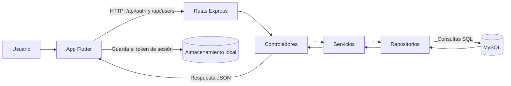

# SmartMarket

SmartMarket mantiene Flutter, Express y Python en proyectos separados. Flutter
está organizado por funcionalidades; el backend y los servicios de IA tienen
carpetas base para crecer sin mezclar sus dependencias ni responsabilidades.

## Arquitectura

```text
lib/
  app/                       # Arranque, router y configuración de Flutter
  core/                      # Componentes y utilidades compartidas
  features/                  # Código agrupado por funcionalidad
    store_navigation/
      data/                  # GLB, persistencia e implementaciones
      domain/                # Entidades y contratos de repositorio
      presentation/          # Estado, pantallas y widgets
    auth/ products/ ...       # Espacio para funcionalidades futuras
backend/
  src/
    routes/                  # Declaración y montaje de rutas HTTP
    controllers/             # Adaptación HTTP: petición/respuesta
    services/                # Casos de uso y coordinación de lógica
    repositories/            # Acceso a datos y proveedores externos
    models/                  # Modelos del backend
    database/                # Conexión MySQL y esquema SQL
    middlewares/              # Middleware de Express
    config/                  # Configuración del servidor
    app.ts server.ts          # Creación e inicio de Express
ai/
  models/                    # Modelos Python
  services/                  # Servicios Python de IA
Modelos_3D/
  supermercado_natural.blend     # Supermercado Natural (editable; no va en el APK)
  supermercado_1.glb             # Exportación de supermercado_natural.blend
  SmartMarket_mapa3D_2.blend     # SmartMarket Piloto, con productos editables
  supermercado_2.glb             # Exportación de SmartMarket_mapa3D_2.blend
  texturas/                      # Atlas horneado que usa el mapa piloto
  scripts/                       # Generador de cajas, etiquetas y nodos del piloto
```

La comunicación prevista es **Flutter → Express → MySQL / AI**. Flutter consume
la API HTTP; Express valida y coordina las peticiones mediante sus capas, y los
servicios del backend son el punto de integración con MySQL y los servicios
Python de `ai/`.

En Flutter, cada funcionalidad mantiene sus propias capas: `presentation`
muestra la interfaz, `domain` contiene reglas y contratos, y `data` implementa
el acceso a datos. `app/` conecta la aplicación y `core/` contiene elementos
realmente compartidos.

### Flujo de las solicitudes



## Backend

Desde `backend/`, instala dependencias con `npm install`, copia `.env.example`
a `.env` y configura `DB_HOST`, `DB_PORT`, `DB_USER`, `DB_PASSWORD` y `DB_NAME`;
el backend arma la conexión a MySQL con esos valores. `DB_PORT` usa 3306 por
defecto. El puerto HTTP se configura con `PORT` (3000 por defecto). Ejecuta el
servidor de desarrollo con `npm run dev` o compílalo con `npm run build`. El
esquema de la tabla está en `backend/src/database/schema.sql`.

Configura `PASSWORD_HASH_KEY` y `AUTH_TOKEN_SECRET` con valores aleatorios,
privados y distintos de al menos 32 bytes. Las contraseñas se procesan con
HMAC-SHA-256 usando `PASSWORD_HASH_KEY` y después con bcrypt (coste 12); ni la
contraseña ni el HMAC se almacenan. Mantén ambas claves privadas y estables:
cambiar la clave de hash impide verificar las contraseñas registradas y cambiar
la clave de token invalida las sesiones activas.

### Inicializar en Windows

Abre PowerShell en la raíz del repositorio. Asegúrate de tener Node.js, MySQL y
Flutter instalados, e inicia el servicio de MySQL. En la primera configuración,
crea la base de datos e importa el esquema (estos comandos solicitan la
contraseña de MySQL):

```powershell
mysql -h 127.0.0.1 -P 3306 -u root -p -e "CREATE DATABASE IF NOT EXISTS smartmarket;"
cmd /c "mysql -h 127.0.0.1 -P 3306 -u root -p smartmarket < backend\src\database\schema.sql"
```

Prepara el archivo de configuración del backend. Edita `.env` para que coincida
con tu instalación de MySQL y reemplaza las dos claves de ejemplo por valores
aleatorios, privados y distintos:

```powershell
if (-not (Test-Path .\backend\.env)) { Copy-Item .\backend\.env.example .\backend\.env }
notepad .\backend\.env
Set-Location .\backend
npm ci
npm run dev
```

Deja esa terminal abierta mientras usas la app. En una segunda terminal de
PowerShell, desde la raíz del repositorio, instala las dependencias de Flutter y
elige un emulador Android disponible:

```powershell
flutter doctor
flutter pub get
flutter devices
flutter run -d emulator-5554 --dart-define=API_BASE_URL=http://10.0.2.2:3000/api
```

Sustituye `emulator-5554` por el ID mostrado por `flutter devices`. Para un
teléfono Android conectado a la misma red Wi-Fi que la computadora, usa la IP
local de Windows en lugar de `10.0.2.2`, permite el puerto `3000` en el firewall
y ejecuta:

```powershell
flutter run --dart-define=API_BASE_URL=http://192.168.1.20:3000/api
```

Reemplaza `192.168.1.20` por la IP de la computadora que ejecuta el backend.

### Autenticación

La app inicia en la pantalla de login y guarda el token en el almacenamiento
local del dispositivo. El token contiene la identidad mínima (`username` y
`role`) además de los tiempos técnicos de emisión y expiración; no incluye
correo, contraseña ni otros datos del usuario. Las sesiones vencen a las ocho
horas.

| Método | Ruta | Descripción |
| --- | --- | --- |
| `POST` | `/api/auth/login` | Iniciar sesión con `email` y `password` |
| `GET` | `/api/auth/me` | Validar el token `Bearer` y devolver `username` y `role` |

### API de usuarios

La API valida los datos, usa consultas parametrizadas y nunca devuelve
`password_hash`. Los roles admitidos son `user` y `admin`. Al crear usuarios,
el rol inicial es `user`; la API no permite asignar ni cambiar roles porque
todavía no hay autenticación/autorización para proteger esas operaciones.
Mientras no haya autorización, crea o promueve el administrador directamente
en MySQL usando una cuenta administrativa.

| Método | Ruta | Descripción |
| --- | --- | --- |
| `POST` | `/api/users` | Crear usuario (`name`, `last_name`, `email`, `password`) |
| `GET` | `/api/users` | Listar usuarios |
| `GET` | `/api/users/:userId` | Consultar usuario |
| `PATCH` | `/api/users/:userId` | Actualizar nombre, apellido, correo, contraseña o estado |
| `DELETE` | `/api/users/:userId` | Desactivar usuario (baja lógica) |

La app permite crear una cuenta desde su pantalla de registro, pero no incluye
un panel para listar ni administrar usuarios. Las rutas de `/api/users` siguen
sin autenticación ni autorización; no las expongas a usuarios o redes no
confiables.

### Conectar Flutter con el backend

Flutter consume la API HTTP; el teléfono no se conecta directamente a MySQL.
La aplicación ofrece registro y login para acceder al supermercado, sin una
vista de administración de usuarios. La URL predeterminada es
`http://10.0.2.2:3000/api`, que permite al emulador Android acceder al servidor
que corre en la computadora. Inicia el backend con `npm run dev` desde
`backend/` y ejecuta Flutter en modo depuración:

```bash
flutter run
```

En un teléfono físico, indica la IP local de la computadora (ambos deben estar
en la misma red):

```bash
flutter run --dart-define=API_BASE_URL=http://192.168.1.20:3000/api
```

Reemplaza `192.168.1.20` por la IP de la computadora y permite el puerto HTTP
configurado por `PORT` en el firewall. Android solo permite HTTP sin cifrar en
compilaciones de depuración; para distribuir la app, configura una URL HTTPS.

### Inicializar en iOS

Para compilar o ejecutar Flutter en iOS necesitas una Mac con Xcode; no es
posible compilar la app para iOS desde Windows. En la Mac, desde la raíz del
repositorio, acepta las licencias de Xcode, instala los paquetes de Flutter e
inicia el simulador:

```bash
flutter doctor
sudo xcodebuild -runFirstLaunch
sudo xcodebuild -license accept
flutter pub get
open -a Simulator
flutter devices
```

Usa el ID del simulador o del iPhone que aparezca en `flutter devices`. Si el
backend corre en la misma Mac que el simulador, inicia `npm run dev` en otra
terminal y ejecuta:

```bash
flutter run -d <ID_DEL_SIMULADOR> --dart-define=API_BASE_URL=http://127.0.0.1:3000/api
```

Para un iPhone físico, o si el backend corre en una PC Windows, ambos
dispositivos deben estar en la misma red. Cambia `192.168.1.20` por la IP local
de la computadora que ejecuta el backend, permite el puerto HTTP en su firewall
y usa esa dirección:

```bash
flutter run -d <ID_DEL_IPHONE> --dart-define=API_BASE_URL=http://192.168.1.20:3000/api
```

Reemplaza los valores de ejemplo por los IDs y la IP reales. La configuración y
el rendimiento de iOS todavía no están validados en este proyecto.

## Dos supermercados y nombres editables

Los botones **Natural / Piloto** bajo el título cambian de modelo. Ambos GLB usan
el mismo esquema de extras de Blender:

| kind | Objeto | Datos |
| --- | --- | --- |
| `product_location` | `slot_<SLOT>` (Empty) | `slot_id`, `shelf_id`, `route_node` |
| `product_group` | `producto_<ID> \| <nombre>` (Empty) | `product_id`, `display_name`, `category`, `route_node` |
| `product_box` | `caja_<ID>_<fila><col>` (Mesh) | `product_id`, `row`, `column`; frente = eje local −Y |
| `editable_label` | `etiqueta_<ID>_<fila><col>` (Texto) | `text` (solo en el .blend del piloto) |
| `route_node` | `node_*` (Empty) | `node_id`, `vecinos` (piloto) |

La app no dibuja los textos de Blender: dibuja etiquetas propias sobre la cara
frontal de cada caja (una textura compartida, 1 llamada de dibujo). Toca una caja o
abre **Productos** (icono de inventario) para buscar, enfocar y renombrar. Los
cambios se guardan en el teléfono por supermercado (`shared_preferences`) y no
modifican el GLB. **Restaurar** vuelve al nombre del .blend.

Para regenerar el piloto después de editar el plano en Blender 5.x:

```bash
blender -b Modelos_3D/SmartMarket_mapa3D_2.blend -P Modelos_3D/scripts/agregar_productos_mapa.py -- --export
```

El script es repetible: borra y vuelve a crear los 247 grupos (988 cajas), usa
`catalogo_nombres.py` para los nombres iniciales y exporta `supermercado_2.glb`.
Guarda el .blend desde Blender si quieres conservar el resultado en el archivo.

## Cámara

Perspectiva libre, como el visor de Blender: un dedo gira alrededor del punto
central, dos dedos desplazan y hacen zoom hacia el punto pellizcado (hasta 35 cm
del objetivo). El botón de la mano cambia un dedo a desplazamiento. Botones:
acercar, alejar, girar 45° a cada lado, vista superior, vista de pasillo, nodos de
ruta y centrar. Con ratón: izquierdo gira, derecho desplaza, rueda acerca.

`presentation` consume el contrato de `domain`; `data` lo implementa y `app`
conecta ambos. El WebView queda dentro de la presentación de la vista 3D.
Three.js r180 está empaquetado en `assets/store_viewer/`, con su licencia MIT.
Riverpod administra la carga; go_router administra las rutas. No hay generadores
de código ni casos de uso vacíos. Añadirlos cuando exista lógica que lo requiera.

## Ejecutar en Android

```powershell
flutter pub get
flutter emulators
flutter emulators --launch Medium_Phone_API_36.0
flutter devices
flutter run -d emulator-5554
```

Usa el ID que aparezca en `flutter devices` si es diferente. La app abre
directamente el **Supermercado Natural**; el botón **Piloto** abre el otro mapa.

### Instalación y depuración

Si aparece `INSTALL_FAILED_INSUFFICIENT_STORAGE`, el APK se compiló pero Android
no tiene espacio suficiente para instalarlo. Comprueba el almacenamiento interno
del emulador con `adb -s emulator-5554 shell df -h /data`. Limpiar el proyecto con
`flutter clean` no libera ese almacenamiento. El APK de debug incluye el motor y
las herramientas de depuración; los archivos `.blend` no se empaquetan.

En esta máquina, `Medium_Phone` y `Medium_Phone_API_36.0` son dispositivos
distintos. Usa `Medium_Phone_API_36.0` para esta prueba: la instalación falló por
falta de espacio en `Medium_Phone`. En VS Code selecciona el emulador iniciado en
la barra inferior y pulsa **F5**, o ejecuta `flutter run -d emulator-5554 --debug`.
Con el terminal de Flutter activo, **r** hace hot reload y **R** reinicia Dart.

Espera a que terminen las actualizaciones de Android antes de probar: actualizar
Android System WebView puede cerrar SmartMarket porque su mapa usa ese
componente. Los registros `SMARTMARKET_3D ready` confirman que el mapa cargó.
Para ver un cierre nativo usa `adb -s emulator-5554 logcat -b crash -d`.

## Rendimiento

Pulsa el velocímetro de la barra superior para abrir **Rendimiento 3D**. Muestra
FPS de fotogramas 3D completados, llamadas de dibujo, triángulos visibles,
tamaño del archivo, duración de preparación 3D y número de IDs/nodos. La duración
3D incluye inicialización del WebView y preparación del modelo, pero no la lectura
previa del asset. Los FPS corresponden al ciclo de dibujo WebGL; no son una
medición directa del tiempo de GPU ni de los fotogramas de Flutter.

El panel activa el dibujo continuo para poder medir. Al cerrarlo, la escena se
dibuja solo cuando cambia la cámara o el tamaño de la ventana. En segundo plano
se suspende el dibujo. Las métricas se actualizan una vez por segundo sin
reconstruir toda la vista. Se registran en consola como `SMARTMARKET_3D`.

Configuración inicial: resolución 3D limitada a 1,5 píxeles por píxel lógico, sin sombras,
sin antialiasing y sin luces nuevas. Se conserva `KHR_materials_unlit`, las mallas
de etiquetas, colores y metadatos del GLB. Las copias de una misma malla se
dibujan mediante instancias al cargar; no se modifica el GLB ni el `.blend`.
La jerarquía original con `extras` se conserva invisible para futuras consultas.
Las instancias visuales son estáticas: una futura actualización de inventario
deberá actualizar las instancias y etiquetas, además del nodo de datos.

Prueba sugerida: abrir el panel, esperar a que se estabilice, recorrer pasillos,
hacer zoom y regresar a la vista general. Comparar los valores mientras el mapa
se mueve. El emulador y el modo debug sirven para comprobar funcionamiento y
detectar problemas; para validar rendimiento móvil hace falta un teléfono físico
con `flutter run --profile` y Flutter DevTools. No hay inventario, búsqueda de
productos ni cálculo de rutas implementados todavía.

Prueba realizada en `Medium_Phone_API_36.0` (Android x86_64, modo profile):
aproximadamente 59–60 FPS estabilizados y 175 llamadas de dibujo en la vista
general con 55.112 triángulos. La primera preparación 3D tardó 12,36 s; tras
reabrir la versión final tardó 4,38 s. La nitidez está limitada a una escala de
1,5. Estos valores corresponden a este emulador y al visor WebGL, y deben volver
a medirse en un dispositivo físico. Las pruebas conservan colores, matrices,
triángulos, IDs de productos y nodos, y verifican la recuperación de errores.

```powershell
flutter analyze
flutter test
node --experimental-default-type=module --test test/store_viewer/instancing_test.mjs
```

Referencias: [arquitectura Flutter](https://docs.flutter.dev/app-architecture/guide),
[rendimiento Flutter](https://docs.flutter.dev/perf/ui-performance),
[WebView Flutter](https://pub.dev/packages/webview_flutter),
[Three.js](https://github.com/mrdoob/three.js/releases/tag/r180).

El visor y GLB se sirven desde un servidor interno limitado a `127.0.0.1`, con
puerto y ruta temporal. No necesita conexión externa. Android permite HTTP solo
para esa dirección mediante `network_security_config.xml`. La prueba de hoy es
Android; la configuración y el rendimiento de iOS todavía no están validados.
